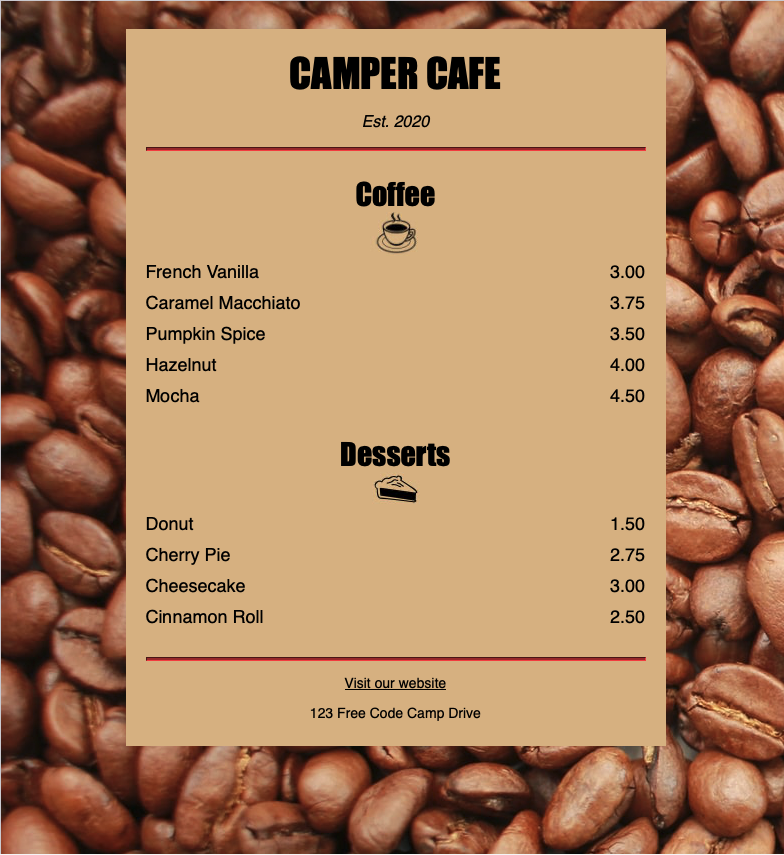

# Camper Cafe Menu




This project is a simple cafe menu webpage styled using CSS.

## Table of Contents

- [Description](#description)
- [Screenshot](#screenshot)
- [Technologies Used](#technologies-used)
- [How to Use](#how-to-use)
- [License](#license)

## Description

The Camper Cafe Menu webpage displays a list of coffee and dessert items along with their prices. It features a stylish layout with centered text, images, and menu items. The webpage is designed to be responsive and visually appealing.

## Screenshot


## Technologies Used

This project is built with the following technologies:

- **HTML:** Used for the structure and content of the webpage.
- **CSS:** Utilized for styling and layout design.

## How to Use

To use this project, follow these steps:

1. Clone the repository:

   ```bash
   git clone https://github.com/Researcher0619/Camper-Cafe-Menu.git
